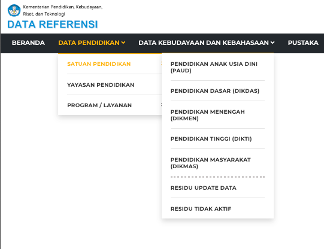
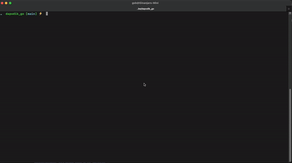

  

Gin-Dapodik adalah aplikasi yang digunakan untuk melakukan scraping data [Dapodik](https://referensi.data.kemdikbud.go.id/).\
Khususnya pada bagian menu DATA PENDIDIKAN (PAUD, DIKDAS, DIKMEN, DIKTI, DIKMAS).

Aplikasi ini berbasis CLI (Command Line Interface) yang bisa dijalankan pada Sistem Operasi Windows, Linux dan MacOS.\
Saat ini Gin-Dapodik hanya bisa melakukan download seluruh data sekolah berdasarkan provinsi yang dipilih.\
Hasil seluruh data yang didapatkan bisa berupa JSON atau Excel (xlsx) file, tergantung saat memilih menu ekstraksi data.

### Cara Instalasi
1. Download saja file `gin-dapodik` pada bagian [release](https://github.com/egin10/dapodik_go/releases).
Sesuaikan dengan Sistem Operasi yang digunakan.
2. Setelah download, silahkan pindahkan ke folder yang kalian inginkan. Seperti `Dekstop` atau `Downloads`. (Opsional)

### Cara Penggunaan
1. Buka terminal andalan kalian. Misal di Windows bisa dengan `CMD`, sedangkan pengguna Linux atau MacOS bisa pakai terminal bawaan saja.
2. Navigasikan ke folder lokasi file aplikasi `gin-dapodik` berada. Misal tadi ada di `Desktop` atau `Downloads`.
3. Jalankan dengan perintah berikut

| Sistem Operasi |     Perintah      |
| :------------- | :---------------: | 
| Windows        |  gin-dapodik.exe  | 
| Linux          |   ./gin-dapodik   | 
| MacOs          |   ./gin-dapodik   | 

4. Tunggu proses download data sampai selesai. Waktu yang dibutuhkan tergantung koneksi internet 🚀.

5. Hasil download akan berupa file dengan nama berikut

| Jenis Ekstraksi |     Nama File     |
| :-------------  | :---------------: | 
| JSON            |  data_sekolah  | 
| Linux           |   ./gin-dapodik   | 

### Ilustrasi Aplikasi

### Teknologi
Aplikasi ini dibangun dengan menggunakan bahasa pemrograman Golang dan menggunakan beberapa library, yaitu:
- [Go-Colly](https://go-colly.org/) untuk web scraping.
- [Huh?](https://github.com/charmbracelet/huh) untuk interaktif aplikasi CLI.

### Mau ikutan kontribusi?
Boleh 🗿\
kamu bisa join untuk ngembangin project ini biar lebih baik kedepannya dengan cara [berikut ini](https://github.com/endymuhardin/belajarGit/blob/master/cara-berkontribusi-opensources-github.md).

### Mau sawer?
Boleh 👾\

Happy Coding 🚀

___
\
Copyright (c) 2024 [egin10](https://github.com/egin10)